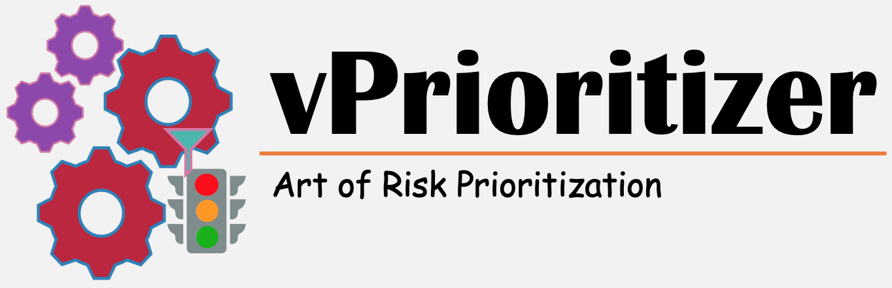

 \| [Overview](#overview) \| [How it works](how-it-works) \| [Quickstart](quickstart) \| [Roadmap](roadmap) \| [Contact Me](#contribution--contact-me)

# Overview
As indicated by sources like vulndb & cve, on a daily basis, approximately 50 new vulnerabilities become known to industry and it’s safe to assume that count is going to increase furthermore. It’s a huge number of vulnerabilities to assess and remediate effectively and quickly. So today organizations are focusing (or should focus) on reducing the risk rather than eliminating it and vulnerability management is (almost) equal to risk prioritisation and risk is a variable and dynamic concept determined by multiple factors.

Theoretically, the approach of considering factors like base CVSS, asset accessibility, criticality, exploit availability, business sensitivity etc. looks appropriate to adopt but it’s not practically possible to do it manually for every vulnerability affecting every asset by every organisation. 

# Goals and Philosophy 
To overcome above challenges, vPrioritizer is designed with primary objectives as below: 

1. Centralized - must serve as single-pane-of-glass for vulnerability management
2. Automated - any and every task which can be automated, must be automated
3. Community Analytics - utilization of community analytics to mature the prioritization algorithm over the period of time

[Read More…](https://medium.com/@rana.miet/learn-to-say-no-to-almost-every-vulnerability-intro-to-vprioritizer-9b2aa15369a1?sk=28c65b8540f31eab5e99a751c24240f3)

# How it Works
vPrioritizer gives us ability to assess the risk on different layers such as (and hence comprehensive control on granularity of each of risk as described above in risk calculation section):

- We can assign significance on per asset basis 
- We can assess severity on per vulnerability basis
- At the same time, we can adjust both factors at asset & vulnerability relationship level 
- On top of that, community analytics provides insights as suggested risk

vPrioritizer enables us to understand the contextualized risk pertaining to each asset by each vulnerability across the organization. It’s community based analytics provides a suggested risk for each vulnerability identified by vulnerability scanners and further strengthens risk prioritization process. So at any point of time teams can make an effective and more informed decision, based on unified and standardized data, about what (vulnerability/ties) they should remediate (or can afford not to) and on which (asset/s).

# Quickstart
### For Linux users:
1. Install [docker & docker-compose](https://docs.docker.com/install/linux/docker-ce/debian/#install-using-the-repository)
   - sudo apt-get update
   - sudo apt-get install docker-ce docker-compose
2. wget https://raw.githubusercontent.com/varchashva/vPrioritizer/master/docker-compose.yml
3. docker-compose up
4. Browse to http://localhost:7777/ and you are set to explore the tool :)

### For Windows and Mac users:
1. Install [postgres](https://www.postgresql.org/docs/9.3/installation.html)
2. Create user and database with below details:
   - Username: vprioritizer
   - Password: vprioritizer
   - Database Name: vprioritizer
3. git clone https://github.com/varchashva/vPrioritizer.git
4. cd vPrioritizer
5. python manage.py runserver 0.0.0.0:7777
6. Browse to http://localhost:7777/ and you are set to explore the tool :)

# DEMO 

# Roadmap
- Integration with scanners API:
  - [ ] Nexpose
  - [ ] QualysGuard
  - [ ] Nessus
  - Cloud Native Scanner
    - [ ] AWS Inspector
    - [ ] Azure Security Center
    - [ ] GCP Security Command Center
- [ ] “Custom Upload Field” module
- [ ] Cumulation of vulnerabilities 
- [ ] Custom “Settings” page
- [ ] Maintaining the KB for vulnerabilities 
- [ ] “Help” for vulnerabilities by OSINT
- [ ] Prioritization algorithm maturity (ongoing)

# Contribution & Contact Me 

Thanks to [Jyoti Raval](https://www.linkedin.com/in/jyoti-raval-61565157) for being an exceptional QA.

Please reach out to me for any query/comment/suggestion: [LinkedIn](https://www.linkedin.com/in/pramod-rana-696ba062/) \| [Twitter](https://twitter.com/IAmVarchashva) \| [Raise an issue](https://github.com/varchashva/vPrioritizer/issues/new)

